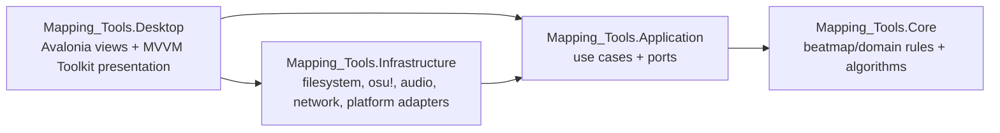

# Mapping Tools feature dependency graph and Avalonia migration plan

Status: initial repository-wide migration baseline, 2026-07-18.

User acceptance gates and feature-level scenarios are defined in [user-acceptance-test-plan.md](user-acceptance-test-plan.md).

This document inventories the user-visible features in the WPF application, defines the shared subsystems they depend on, and orders their migration to `Mapping_Tools.Desktop` (Avalonia 12.1.0). It is based on static inspection of `Mapping_Tools/Views`, `Mapping_Tools/Viewmodels`, `Mapping_Tools/Components`, `Mapping_Tools/Classes`, the application shell, and the current test suite.

## Scope and graph semantics

- An arrow `A --> B` means **A depends on B** and B should normally migrate first.
- A feature is complete only when its behavior, error/cancellation paths, persistence, and required adapters work in Avalonia. Rendering an equivalent screen is not sufficient.
- “Windows adapter” means the interface remains platform-neutral, but the current implementation may still require Windows or osu! stable internals.
- The graph covers every discoverable user-facing tool, shell workflow, auxiliary window, and cross-cutting runtime capability. Private mathematical/helper classes are grouped into the subsystem that owns them.
- The graph is a migration graph, not a proposal to create one project or assembly per node.

## Target architecture

Rules:

1. Core has no UI, filesystem dialog, dispatcher, process, or operating-system dependencies.
2. Application owns use cases and interfaces for side effects.
3. Infrastructure implements those interfaces. Windows-only integrations are explicit adapters rather than hidden static calls.
4. Desktop owns Avalonia controls, navigation, view activation, and MVVM Toolkit presentation state.
5. The WPF application consumes the same Application/Core behavior until the final cutover.

## Shared subsystem catalog

| ID | Subsystem | Current implementation | Responsibility | Migration target / prerequisite |
|---|---|---|---|---|
| C1 | Beatmap document model | `Classes/BeatmapHelper` | Parse, represent, edit, and serialize `.osu`/`.osb` data: timing, hit objects, sliders, bookmarks, metadata, colours, events, storyboard commands, and samples. | Core. Preserve round-trip behavior with characterization tests before moving feature logic. |
| C2 | Mathematics and primitives | `Classes/MathUtil`, `Vector2`, type converters | Geometry, interpolation math, precision, gradients, ranges, and shared value conversion. | Numeric/domain pieces to Core; UI converters to Desktop. |
| C3 | Slider geometry | `BeatmapHelper/SliderPathStuff`, `ToolHelpers/Sliders` | Parse, approximate, subdivide, reconstruct, merge, and generate slider paths. | Core. Required by all slider-family features and Geometry Dashboard. |
| C4 | Tool algorithms | `Classes/Tools/*` | Feature-specific transformations: cleaner, auto-fail detection, rhythm guide, pattern handling, Sliderator, picturation, tumour generation, and geometric generators. | Move one bounded algorithm slice to Core/Application with its feature. Do not bulk-move UI-bound classes. |
| C5 | Hitsound domain | `Classes/HitsoundStuff` | Hitsound layers/zones/events, import schemas, samples, custom indices, effects, MIDI representation, and sample-generation arguments. | Models/rules to Core; audio decoding/encoding/playback to Infrastructure. |
| A1 | Current beatmap workspace | `MainWindow` current-map methods, `IOHelper` | Selected map paths, current osu! map lookup, recent maps, drag/drop map selection, and change notification. | Application `IBeatmapWorkspace`; Infrastructure adapters for memory/editor lookup. Remove feature calls to `MainWindow.AppWindow`. |
| A2 | Beatmap editing gateway | `Editor`, `BeatmapEditor`, `StoryboardEditor`, `EditorReaderStuff` | Load the correct on-disk/editor version, mutate it, save it, reload the editor, and expose selected objects. | Core document editors plus Application gateway; Windows EditorReader implementation in Infrastructure. |
| A3 | Backup and undo | `BackupManager`, parts of `ListenerManager` | Pre-run backups, periodic backups, QuickUndo, and backup restore. | Application service plus filesystem implementation. Required before any destructive tool is accepted. |
| A4 | Settings and paths | `Settings`, `SettingsManager` | Configuration persistence, osu!/Songs/config/backups paths, theme, favorites, recent maps, backup policy, editor-reader policy, and hotkeys. | Application settings model/store contract; JSON/registry/filesystem implementation in Infrastructure. |
| A5 | Project persistence | `ProjectManager`, `ISavable<T>`, extra project-menu interfaces | Autosave, new/load/save project, feature-specific save folders, extra autosave targets, collection import/export. | Application project-store service. UI confirmations and pickers are injected ports. Preserve existing JSON compatibility. |
| A6 | Tool execution | `SingleRunMappingTool`, `BackgroundWorker`, `MessageWindow` | Run-state, validation, progress, cancellation, success/error reporting, and post-run reload. | Application use-case result/progress model plus Desktop command/view state. Replace `BackgroundWorker` incrementally with task/cancellation abstractions. |
| A7 | QuickRun and hotkeys | `IQuickRun`, `ListenerManager`, `HotkeyEditorControl` | Smart target selection, global shortcuts, QuickRun, QuickUndo, BetterSave, auto-reload, and run-finished signaling. | Application command registry; Windows global-keyboard adapter; Avalonia hotkey editor. Manual in-app execution must work before global hotkeys are enabled. |
| A8 | File/platform interaction | `IOHelper`, `ShowSelectedInFileExplorer`, shell/process calls | Open/save/folder pickers, reveal/open URLs, clipboard, file launching, app data/export folders. | Application ports; Avalonia `StorageProvider`/launcher where supported and explicit platform adapters otherwise. |
| D1 | Application shell | `MainWindow`, `MainWindowVm`, `ViewCollection`, `StandardView` | Tool discovery, navigation/search/favorites, current view activation, title/scroll behavior, project menu, current-map controls, notifications, window state, and shutdown autosave. | Desktop shell with explicit feature registrations. Avoid reflection over UI types as the long-term feature registry. |
| D2 | Forms and common presentation | `Components/Domain`, `ViewHeaderComponent`, drag/drop controls | Validation, formatting, enum/boolean conversion, headers, list reordering, common inputs, and focus helpers. | Core parsing/validation rules plus small Avalonia converters, behaviors, and reusable views. |
| D3 | Dialog system | `Components/Dialogs`, `MessageWindow`, feature dialogs | Messages, beatmap import, typed values, sample selection, reflection-driven custom forms, and confirmations. | Application interaction contracts plus typed Avalonia dialogs. Do not reproduce the reflection/WPF-control coupling in `CustomDialog`. |
| D4 | Timeline visual | `Components/TimeLine` | Display timestamped findings and navigation markers. | Avalonia reusable control. Required by Auto-fail Detector and Map Cleaner. |
| D5 | Object visualizer | `Components/ObjectVisualiser` | Render hit objects/pattern thumbnails and markers. | Separate framework-neutral scene data from Avalonia rendering. Required by Pattern Gallery, Sliderator, and Tumour Generator. |
| D6 | Graph/value editor | `Components/Graph`, `ValueOrGraphControl` | Editable anchors, interpolators, markers, snapping, derivatives/integrals, animations, and constant-or-curve parameters. | Interpolation/state models to Core; pointer/rendering control to Desktop. Required by Sliderator and Tumour Generator. |
| D7 | Audio visualization | `Components/Spectrum` | Draw audio spectrum data used by hitsound workflows. | Audio analysis service plus Avalonia rendering control. |
| I1 | osu! live integration | `EditorReader.dll`, `OsuMemoryDataProvider` | Locate the current map, inspect selected objects/editor state, read unsaved state, and request reload/save behavior. | Windows-specific Infrastructure adapters behind Application interfaces. |
| I2 | Global input/process integration | keyboard-hook library, WinForms cursor/screen APIs, `Process.NET` | Global hotkeys, absolute cursor movement, screen coordinates, osu! process memory, and process/window access. | Windows-specific Infrastructure. Geometry Dashboard remains Windows-only until replacements are proven. |
| I3 | Overlay rendering | `Overlay.NET`, `SnappingToolsOverlay` | Transparent on-screen geometry overlay aligned to osu!’s playfield. | Explicit Windows overlay host plus Desktop control/model boundary. |
| I4 | Audio import/export | NAudio, NVorbis, OggVorbisEncoder, MIDI/SF2 helpers | Decode, preview, synthesize, limit, and export samples and hitsound packages. | Infrastructure audio services. Keep sample/hitsound rules in Core. |
| I5 | Updates and release lifecycle | `Updater`, Onova, GitHub release lookup | Check, download, skip, stage, and apply application updates. | Infrastructure update service plus Avalonia progress/decision dialog. Port only after packaging format is settled. |

## Whole-project dependency graph

The graph below intentionally groups features by shared migration seam. The feature matrix in the next section is the authoritative detailed mapping.

```mermaid
flowchart TB
    Shell["Shell / navigation / Get started"] --> Settings["A4 Settings and paths"]
    Shell --> Projects["A5 Project persistence"]
    Shell --> Workspace["A1 Current beatmap workspace"]
    Shell --> QuickRun["A7 QuickRun and hotkeys"]
    Shell --> Dialogs["D3 Dialog system"]
    Shell --> Updater["I5 Updater"]

    Preferences["Preferences"] --> Settings
    Preferences --> QuickRun
    Preferences --> Platform["A8 File/platform interaction"]

    Workspace --> Live["I1 osu! live integration"]
    Workspace --> Beatmap["C1 Beatmap model"]
    Projects --> Platform
    Backup["A3 Backup and undo"] --> Platform
    Execution["A6 Tool execution"] --> Backup
    QuickRun --> Execution
    QuickRun --> GlobalInput["I2 Global input/process"]
    Editor["A2 Beatmap editing gateway"] --> Beatmap
    Editor --> Live

    AutoFail["Auto-fail Detector"] --> Timeline["D4 Timeline"]
    Cleaner["Map Cleaner"] --> Timeline
    AutoFail --> Editor
    Cleaner --> Editor

    Metadata["Metadata Manager"] --> Editor
    Property["Property Transformer"] --> Editor
    TimingCopier["Timing Copier"] --> Editor
    TimingHelper["Timing Helper"] --> Editor
    Rhythm["Rhythm Guide"] --> Editor

    SliderCompletion["Slider Completionator"] --> SliderCore["C3 Slider geometry"]
    SliderMerger["Slider Merger"] --> SliderCore
    SliderPicturator["Slider Picturator"] --> SliderCore
    Sliderator["Sliderator"] --> SliderCore
    Tumour["Tumour Generator 2"] --> SliderCore
    Geometry["Geometry Dashboard"] --> SliderCore

    Pattern["Pattern Gallery"] --> ObjectVisual["D5 Object visualizer"]
    Sliderator --> ObjectVisual
    Tumour --> ObjectVisual
    Sliderator --> Graph["D6 Graph/value editor"]
    Tumour --> Graph

    HitsoundPreview["Hitsound Preview Helper"] --> Rhythm
    HitsoundPreview --> HitsoundDomain["C5 Hitsound domain"]
    HitsoundCopier["Hitsound Copier"] --> HitsoundDomain
    HitsoundStudio["Hitsound Studio"] --> HitsoundDomain
    HitsoundStudio --> Audio["I4 Audio import/export"]
    HitsoundStudio --> Spectrum["D7 Spectrum"]

    Combo["Combo Colour Studio"] --> Editor
    Mapset["Mapset Merger"] --> Editor
    Pattern --> Editor
    SliderCompletion --> Editor
    SliderMerger --> Editor
    SliderPicturator --> Editor
    Sliderator --> Editor
    Tumour --> Editor

    Geometry --> Live
    Geometry --> GlobalInput
    Geometry --> Overlay["I3 Overlay rendering"]

    AutoFail --> Execution
    Cleaner --> Execution
    TimingHelper --> Execution
    SliderCompletion --> Execution
    SliderMerger --> Execution
    SliderPicturator --> Execution
    Sliderator --> Execution
    Tumour --> Execution
    Pattern --> Execution
```

Direct feature-to-feature dependencies found in the current code:

- **Hitsound Preview Helper → Rhythm Guide window.** Its view model constructs `RhythmGuideWindow` directly.
- Other tool namespaces referenced from their own view models (`Sliderator`, `SnappingTools`) are internal feature layering violations, not dependencies on another user-facing feature.
- Slider Picturator consumes code in `SlideratorStuff`, but it depends on the shared slider/picturation algorithm, not on the Sliderator screen.

## Feature definitions and dependencies

Complexity is a relative migration estimate: S, M, L, or XL. It reflects UI coupling, code-behind, platform APIs, custom controls, and side effects—not only line count.

| Feature | Definition | Direct migration prerequisites | Special coupling / risk | Size |
|---|---|---|---|---|
| Shell and navigation | Hosts every tool; provides search, favorites, navigation, project menus, current-map selection, notifications, window state, drag/drop, links, and shutdown autosave. | A1, A4, A5, A8, D1, D3; A7 and I5 can be added later. | `MainWindow.AppWindow` is a service locator used throughout the codebase. Reflection creates WPF views and navigation items. | XL |
| Get started | Landing page and onboarding/help entry point. | D1, A8. | Currently also participates in shell links/messages. Good first rendered page. | S |
| Preferences | Configures osu!, Songs, config and backup paths; backup behavior; Editor Reader; BetterSave; QuickRun; smart target mapping; global hotkeys; and light/dark theme. | A4, A7, A8, D2, file pickers; I1/I2 for validation and global hotkeys. | Split into basic settings first and live/global-input settings second. | M |
| Current-map and backup workflows | Open/select/recent maps, fetch current map, save/load/open backups, BetterSave, QuickUndo, drag/drop. | A1, A2, A3, A8, I1. | Currently embedded in `MainWindow`, `IOHelper`, and `ListenerManager`; destructive operations require parity before tool acceptance. | L |
| Project lifecycle | Per-tool autosave, New/Open/Save, extra menu entries, extra autosave targets, and JSON compatibility. | A5, A8, D3. | `ProjectManager` depends on WPF dialogs and on view instances implementing persistence interfaces. | M |
| QuickRun/hotkeys | Runs the current/smart-selected tool from global keys; supports BetterSave and QuickUndo; optionally reloads osu!. | A6, A7, A1, A2, A3, I1, I2. | Global keyboard hooks and WPF dispatcher. Build manual commands first; enable hooks after behavior is tested. | L |
| Auto-fail Detector | Finds overlapping/incorrect object-loading situations that can make scoring invalid; supports AR/OD overrides and displays findings on a timeline. | C1, C2, A1–A3, A6–A7, D2–D4, I1. | QuickRun plus reusable timeline; relatively small algorithm and an ideal first quick-run feature. | M |
| Map Cleaner | Removes useless inherited timing points, rebuilds timing effects, resnaps timing/objects, and performs optional whole-map cleanup operations. | C1, C2, C4 cleaner, A1–A7, D2–D4, I1. | Destructive multi-option transformation; shares timeline/execution stack with Auto-fail Detector. | M |
| Metadata Manager | Imports metadata, edits it once, applies it to multiple difficulties, and saves reusable metadata configurations. | C1, A1–A5, A8, D2–D3, I1. | Media/color types and validation currently leak from WPF into the view model. | M |
| Property Transformer | Applies multiplier-then-offset transforms to timing-point, hit-object, bookmark, and storyboard-sample properties. | C1, C2, A1–A6, D2–D3, I1. | Broad document-section coverage makes regression tests important despite a conventional form UI. | M |
| Timing Copier | Copies timing from one map to another and optionally preserves beat spacing, resnaps objects/bookmarks, or leaves objects fixed. | C1 timing/beat divisors, C2, A1–A6, A8, D2–D3, I1. | Needs deterministic timing/resnap tests and multi-file picking. | M |
| Timing Helper | Uses hit objects, bookmarks, redlines, or greenlines as markers; adjusts BPM and/or inserts redlines so markers become snapped. | C1 timing/beat divisors, C2, C5 marker/sample semantics, A1–A7, D2–D3, I1. | QuickRun, destructive timing edits, and substantial code-behind algorithm orchestration. | L |
| Rhythm Guide | Combines rhythms from multiple maps into circles, either on an existing map or in a new guide map, for hitsounding reference. | C1, C4 rhythm algorithm, A1–A6, A8, D2–D3. | Includes a resizable pop-out `RhythmGuideWindow`; prerequisite for Hitsound Preview Helper parity. | M |
| Hitsound Preview Helper | Places provisional hitsounds by object position/hitsound zones so a mapper can preview a position-based hitsounding workflow. | Rhythm Guide window, C1, C5 zones/schema, A1–A7, D2–D3, I1. | View model directly constructs a WPF window; must become a view/window interaction. | M |
| Hitsound Copier | Copies hitsounds from source to target maps, either overwriting all or only replacing defined hitsounds while preserving unspecified target values. | C1 events/storyboard, C5, A1–A6, A8, D2–D3, I1. | Large code-behind transformation with sample-schema and storyboard handling. | L |
| Hitsound Studio | Imports hitsound layers from beatmaps, MIDI, samples and SoundFonts; reloads sources; edits layers; previews/generates samples; and exports a hitsounded difficulty/package. | C1, C5, A1–A6, A8, D2–D3, D7, I4. | Largest code-behind view, multiple dialogs, NAudio/Vorbis/MIDI/SF2, effects, waveform/spectrum, drag/drop, and complex persistence. | XL |
| Slider Completionator | Changes selected slider duration and/or length while automatically calculating slider velocity and preserving values marked unchanged. | C1, C2, C3, A1–A7, D2–D3, I1. | Good first slider-family feature; validates selection and slider-path service boundaries. | M |
| Slider Merger | Merges selected sliders and circles into one Bézier slider, converting slider types and using linear circle connections. | C1, C2, C3, A1–A7, D2–D3, I1. | QuickRun and editor selection, but no custom rendering control. | M |
| Slider Picturator | Imports an image and generates/distorts a slider path to reproduce it with configurable colors, resolution, quality, and rendering options. | C1–C3, C4 picturation, A1–A8, D2–D3, I1, image service. | `System.Drawing`, WPF bitmap interop, WinForms file dialogs, dispatcher calls, and optional GPU path. | L |
| Sliderator | Creates variable-velocity sliders or streams using editable position/velocity curves, imported selections, optimization options, and a slider preview. | C1–C4, A1–A7, D2–D3, D5–D6, I1. | Custom graph has pointer capture, cursor warping, animations, integrals/derivatives, snapping, and WPF view references in the view model. | XL |
| Tumour Generator 2 | Adds configurable layered geometric “tumours” to slider paths, with templates, wrapping/sidedness, constant-or-graph parameters, and preview. | C1–C4 slider/newgen/tumour algorithms, A1–A7, D2–D3, D5–D6, I1. | Reuses graph/value controls and object preview; async/dispatcher logic; existing core algorithm tests reduce risk. | XL |
| Combo Colour Studio | Defines combo-colour sequences and time-based/single-combo colour points, imports existing colours/colour hax, previews them, and saves projects. | C1 colours, C2, C4 combo project, A1–A5, A8, D2–D3, I1. | Custom drag/drop list and color editing; project model currently inherits UI-oriented bindable base. | L |
| Pattern Gallery | Imports patterns from beatmaps/codes/files, organizes shareable collections, previews patterns, and places selected patterns with timing/overwrite transformations. | C1–C3, C4 pattern algorithms, A1–A8, D2–D3, D5, I1. | Custom/reflection dialogs, virtualized collection UI, ZIP collection import/export, extra autosave/menu behavior, and editor-aware placement. | XL |
| Mapset Merger | Combines multiple mapsets into one and resolves beatmap, audio, image, storyboard, and other filename conflicts. | C1 events/storyboard, C5 sample references, A2, A5, A8, D2–D3, filesystem conflict service. | Heavy directory/file mutation and conflict policy; validate against disposable fixtures. | L |
| Geometry Dashboard | Reads editor/selected objects, generates geometrically relevant points/lines/circles, renders an aligned overlay, and snaps the system cursor while an activation key is held. Includes generator, project, and preference windows. | C1–C3, C4 geometry generators, A4–A5, A7, D2–D3, I1–I3. | Deepest Windows coupling: `Process.NET`, WinForms cursor/screen, global input, overlays, multiple windows, timers/dispatchers, and 1,000+ line view model. | XL |
| Updater | Checks GitHub releases, offers restart/wait/skip, downloads an architecture-specific ZIP, and applies it during restart or shutdown. | A4, A8, D3, I5, final packaging layout. | Onova and process replacement are tied to deployment artifacts. Implement after publish/install strategy is stable. | L |

## Dependency-based migration order

The numbered order is deliberate. A later item may start earlier for research, but it should not be declared migrated until its prerequisites are accepted.

### Wave 0 — Baseline and guardrails

1. **Freeze behavioral fixtures.** Add representative `.osu`, `.osb`, project JSON, pattern collection, mapset, and hitsound fixtures. Record round-trip output and the behavior of every destructive tool.
2. **Split the existing tests by ownership.** Move pure math/beatmap/slider/tumour tests toward Core-facing test projects while keeping WPF integration tests runnable.
3. **Introduce architecture checks.** Fail CI if Core/Application reference WPF, WinForms, Avalonia, ReactiveUI, dialogs, or process APIs.

Exit: both frontends build, fixtures are versioned, and refactors can be checked for output drift.

Implementation artifacts: the versioned catalog is `tests/fixtures/wave0/manifest.json`, test ownership is recorded in [wave-0-test-ownership.md](wave-0-test-ownership.md), and the human legacy-output gate is tracked in [wave-0-baselines.md](wave-0-baselines.md). The gate remains open while any transformation record is `pending-capture` or `captured` rather than `accepted`.

### Wave 1 — Domain foundation

4. **C2 mathematics and primitives.** Move framework-neutral vectors, precision, ranges, and algorithms first.
5. **C1 beatmap document model and editors.** Preserve parse/serialize compatibility, including timing, sliders, events, storyboards, colours, and samples.
6. **C3 slider geometry.** Move tested path approximation/subdivision/reconstruction/generation code.
7. **Framework-neutral portions of C5 hitsound domain.** Move enums, events, zones, schema, layer data, and sample-generation arguments without audio playback.

Exit: Core can load, modify, and round-trip representative maps without referencing either UI framework.

### Wave 2 — Application ports and infrastructure adapters

8. **A8 file/platform ports** and Avalonia storage/launcher adapters.
9. **A4 settings/path service** with legacy JSON compatibility; remove reliance on `MainWindow.AppDataPath`.
10. **A5 project persistence** with typed project data rather than view-owned `ISavable<T>` operations.
11. **A1 current beatmap workspace** and recent-map state.
12. **A2 editing gateway and I1 EditorReader adapter.** Separate on-disk editing from unsaved editor state and selected-object access.
13. **A3 backup/restore/undo.** Make backups mandatory around destructive use cases.
14. **A6 tool execution.** Add task, cancellation, progress, result, and notification contracts.
15. **A7 QuickRun semantics.** Implement in-app command selection first; add the Windows global-hotkey adapter after manual execution is stable.

Exit: a headless Application use case can select/load/edit/backup/save a map and report a result without a Window or UserControl.

Implementation status: steps 8 through 15 are complete and the Wave 2 exit
condition has an automated headless acceptance test. Their contracts, adapters,
behavior, limitations, tests, and compatibility decisions are recorded in
[wave-2-step-8-platform-ports.md](wave-2-step-8-platform-ports.md),
[wave-2-step-9-settings.md](wave-2-step-9-settings.md),
[wave-2-step-10-project-persistence.md](wave-2-step-10-project-persistence.md),
[wave-2-step-11-beatmap-workspace.md](wave-2-step-11-beatmap-workspace.md),
[wave-2-step-12-editing-gateway.md](wave-2-step-12-editing-gateway.md),
[wave-2-step-13-backup-restore-undo.md](wave-2-step-13-backup-restore-undo.md),
[wave-2-step-14-tool-execution-host.md](wave-2-step-14-tool-execution-host.md),
[wave-2-step-15-quickrun-hotkeys.md](wave-2-step-15-quickrun-hotkeys.md), and
[wave-2-completion-validation.md](wave-2-completion-validation.md).
The Avalonia composition root now uses the .NET Generic Host for DI,
configuration, logging, periodic backups, and coordinated tool cancellation
during shutdown.

### Wave 3 — Avalonia shell and common UI

16. **D2 common forms/validation and D3 typed dialogs.** Implement only reusable primitives needed by the next features.
17. **D1 shell and Get started.** Explicit feature registry, navigation/search/favorites, notifications, activation, and window persistence.
18. **Preferences, pass 1.** Paths, backup policy, editor-reader toggle, theme, and settings persistence.
19. **Current-map, backup, and project lifecycle UI.** Map chooser/recent maps, drag/drop, backup operations, and per-feature New/Open/Save.
20. **Preferences, pass 2 and QuickRun UI.** Hotkey editor, smart-target
    configuration, live hotkey rebinding, BetterSave, and QuickUndo controls.

Exit: the Avalonia shell can host independently registered features and exercise all cross-cutting workflows without static WPF state.

Implementation status: steps 16 through 20 are complete. Step 16's reusable
validation contracts and typed dialog presentation are recorded in
[wave-3-step-16-forms-dialogs.md](wave-3-step-16-forms-dialogs.md). Step 17's
explicit feature registry, shell navigation, Get started page, notification
surface, activation lifecycle, window persistence, tests, and source-parity evidence
are recorded in
[wave-3-step-17-shell-get-started.md](wave-3-step-17-shell-get-started.md).
Step 18's path, backup-policy, Editor Reader, theme, validation, and settings
persistence slice is recorded in
[wave-3-step-18-preferences-pass-1.md](wave-3-step-18-preferences-pass-1.md).
Step 19's current-map selection, recent-map activation, explicit backup and
restore actions, QuickUndo command, folder actions, and conditional project
menu contract are recorded in
[wave-3-step-19-current-map-backup-project.md](wave-3-step-19-current-map-backup-project.md).
Step 20's remaining Preferences controls, Smart QuickRun configuration, live
hotkey rebinding, BetterSave use case and Windows override adapter are recorded
in
[wave-3-step-20-preferences-quickrun.md](wave-3-step-20-preferences-quickrun.md).

### Wave 4 — First vertical slices and shared timeline

21. **Rhythm Guide.** First simple savable feature; proves multi-file selection, backup, use-case execution, persistence, and an auxiliary window.
22. **D4 Timeline control.** Port as a small reusable control with framework-neutral marker data.
23. **Auto-fail Detector.** First QuickRun feature; proves smart execution, progress/results, editor selection, and timeline navigation.
24. **Map Cleaner.** Reuses the Auto-fail execution/timeline stack and validates destructive transformations and backups.

Exit: manual run, QuickRun, project persistence, backups, errors, and timeline rendering are proven end-to-end.

Implementation status: steps 21 through 24 are complete. Rhythm Guide's shared Core
generator, live-aware and backup-safe Application use case, legacy-compatible
project model, Avalonia view model/view, and reusable auxiliary-window boundary
are recorded in
[wave-4-step-21-rhythm-guide.md](wave-4-step-21-rhythm-guide.md).
Step 22's framework-neutral marker/scale data and reusable Avalonia custom-drawn
Timeline control are recorded in
[wave-4-step-22-timeline-control.md](wave-4-step-22-timeline-control.md).
Step 23's shared Auto-fail engine, live-aware Application use case, backup-safe
optional fix path, startup QuickRun registration, and Avalonia timeline consumer
are recorded in
[wave-4-step-23-auto-fail-detector.md](wave-4-step-23-auto-fail-detector.md).
Step 24's shared Map Cleaner transformation, legacy project aliases, backup-safe
multi-map Application workflow, recoverable unused-sample handling, QuickRun
registration, and Avalonia timeline consumer are recorded in
[wave-4-step-24-map-cleaner.md](wave-4-step-24-map-cleaner.md).

### Wave 5 — Conventional beatmap tools

Steps 25 and 26 are implemented in the Avalonia frontend. The remaining Wave
5 steps stay ordered because they depend on the same multi-file editing and
timing infrastructure.

25. **Metadata Manager.** Exercises reusable forms and multi-difficulty writes.
26. **Property Transformer.** Exercises broad document transformations and numeric validation. Implemented; see [wave-5-step-26-property-transformer.md](wave-5-step-26-property-transformer.md).
27. **Timing Copier.** Exercises source/target maps, beat divisors, resnapping, and multi-file workflows.
28. **Timing Helper.** Builds on timing infrastructure and QuickRun.

Exit: metadata, timing, object, bookmark, storyboard, and multi-map workflows use the shared Application layer.

### Wave 6 — Slider foundation features

29. **Slider Completionator.** Smallest slider vertical slice; proves selected-slider access and slider-velocity edits.
30. **Slider Merger.** Adds path conversion, multiple selections, and geometric composition.
31. **Slider Picturator.** Add an image abstraction and replace `System.Drawing`/WPF bitmap/WinForms dialog coupling.

Exit: C3 slider services and editor-selection adapters are stable enough for custom visual editors.

### Wave 7 — Hitsound and colour tools

32. **Hitsound Preview Helper.** Reuse the migrated Rhythm Guide auxiliary window through an interaction service.
33. **Hitsound Copier.** Stabilize hitsound/sample/storyboard copying before audio generation.
34. **Combo Colour Studio.** Port color models, drag/drop ordering, import, preview, and project persistence.
35. **Mapset Merger.** Build fixture-driven file/conflict services after beatmap, storyboard, hitsound-reference, and file abstractions are stable.

Exit: non-audio hitsound semantics, colors, mapsets, and complex filesystem fixtures are covered.

### Wave 8 — Reusable visual editors and collection workflows

36. **D5 Object visualizer.** Separate scene/layout data from Avalonia drawing.
37. **Pattern Gallery.** Reuse the visualizer, project extensions, typed dialogs, ZIP/file services, and editor placement gateway.
38. **D6 Graph/value editor.** Move interpolator/state math to Core, then implement Avalonia pointer interaction, snapping, and rendering with dedicated control tests.
39. **Sliderator.** Reuse C3, D5, and D6; remove its view model’s reference back to the view.
40. **Tumour Generator 2.** Reuse C3, D5, and D6; connect existing tumour tests to Core models.

Exit: the two most complex custom-control tools have no WPF types and graph behavior is tested independently of either feature.

### Wave 9 — Audio studio

41. **I4 audio services and D7 spectrum.** Isolate decoding, playback, generation, effects, MIDI/SF2, Ogg export, and spectrum calculation behind interfaces.
42. **Hitsound Studio.** Port layer import/reload, editing, preview, dialogs, schema persistence, and export in sub-slices rather than one large rewrite.

Suggested Hitsound Studio sub-order: layer/model editor → beatmap/sample import → playback → MIDI/SF2 → effects/generation → export dialog/package.

Exit: audio resources are disposed deterministically; import/export fixtures pass; no audio library types appear in Desktop view models.

### Wave 10 — Windows-specialized runtime

43. **Geometry Dashboard core/project models.** Move generators, relevant-object models, serialization, and coordinate math first.
44. **I2/I3 Windows adapters.** Process discovery, editor memory, global activation key, screen/cursor service, window tracking, and overlay host.
45. **Geometry Dashboard UI.** Main dashboard, preferences, save slots, generator settings, and overlay visualization.

Exit: the Windows support boundary is explicit, failure when osu! is unavailable is graceful, and the rest of the application remains cross-platform-capable.

### Wave 11 — Release cutover

46. **I5 updater and updater UI.** Implement only after publish archives, runtime identifiers, installer/update paths, and rollback behavior are fixed.
47. **Parity audit.** Check every feature row above, saved-project compatibility, hotkeys, backups, editor reload, errors, cancellation, and disposal.
48. **Default-executable switch.** Make Avalonia the shipped application only after the parity audit; retain a separately installable legacy build for at least one release if practical.
49. **Legacy removal.** Remove WPF/WinForms views and packages only with explicit approval and after telemetry/issues show no required fallback.

## Per-feature migration checklist

Apply this checklist to each tool in the order above:

1. Capture inputs, outputs, validation, cancellation, backup, editor-reload, and saved-project behavior.
2. Extract the smallest Core algorithm and Application use case required by that feature.
3. Add side-effect ports and WPF adapters so the legacy feature still works.
4. Add focused unit/fixture tests before changing presentation behavior.
5. Implement an MVVM Toolkit view model containing state and commands but no controls, windows, or static shell references.
6. Consult official Avalonia 12.1 documentation and verify APIs against 12.1.0 before writing AXAML or Avalonia code.
7. Implement the Avalonia view with compiled bindings and explicit `x:DataType`.
8. Register it explicitly in the shell; do not remove the WPF version.
9. Build both frontends and run focused tests plus manual interaction checks.
10. Record deferred behavior and platform limitations; remove the legacy feature only after acceptance.

## Known architectural blockers to remove early

- `MainWindow.AppWindow` exposes global paths, current maps, the message queue, the listener, and view dimensions.
- `SettingsManager`, `ProjectManager`, `BackupManager`, and `IOHelper` mix domain behavior, persistence, WPF dialogs, and global state.
- Many view models reference `System.Windows`, WPF media/input types, or feature views/windows.
- `SingleRunMappingTool` owns execution lifecycle inside a WPF control rather than an application service.
- `ViewCollection` discovers controls by reflection and uses view instances as feature identity and persistent state.
- Project JSON uses Newtonsoft type metadata. Preserve compatibility or provide explicit migrations before changing model namespaces/types.
- QuickRun, BetterSave, periodic backups, editor reload, and current-map lookup are entangled in `ListenerManager`.
- Custom graph controls warp the system cursor and rely on WPF input/rendering semantics.
- Geometry Dashboard combines pure geometry, process-memory access, screen conversion, global input, and overlay rendering.
- Hitsound Studio combines domain models, audio I/O, playback, generation, serialization, dialogs, and UI editing in one feature surface.

## Existing test assets to retain and expand

The current suite already covers beatmap parsing, slider paths, Bézier subdivision, path reconstruction, math, type converters, listener behavior, combo-colour projects, and tumour generation/templates. These tests should move with the code they protect. Missing high-priority characterization areas are:

- Beatmap parse/serialize round trips across all sections.
- Every destructive tool’s before/after `.osu` fixture.
- Project JSON compatibility for every `ISavable<T>` feature.
- Timing copy/helper edge cases and beat-divisor resnapping.
- Hitsound copy/schema and storyboard sample behavior.
- Pattern collection import/export and placement.
- Mapset conflict resolution using disposable directories.
- Sliderator graph evaluation and generated path fixtures.
- Audio import/export and resource disposal.
- Current-map/editor-unavailable fallbacks, backup, QuickUndo, and cancellation.

## Definition of migration completion

The whole migration is complete only when:

- Every feature and support workflow in the feature table has an accepted Avalonia implementation or an explicitly approved deprecation.
- Core and Application contain no WPF, WinForms, Avalonia, ReactiveUI, process, screen, cursor, or dialog dependencies.
- Both UI projects build during the transition; the legacy project is removed only at final cutover.
- Saved settings, projects, pattern collections, map files, and other user data either load unchanged or have tested migrations.
- Destructive tools always create/offer the same backup protections as the legacy application.
- Windows-only functionality is isolated and clearly reported rather than silently preventing other platforms from running.
- The shipped installer/update path has a tested rollback story.

## Avalonia sources used for this plan

- Avalonia 12.1.0 release notes: https://github.com/AvaloniaUI/Avalonia/releases/tag/12.1.0
- Avalonia 12 breaking changes, including compiled bindings, dialogs, input, clipboard, dispatchers, and rendering changes: https://docs.avaloniaui.net/docs/avalonia12-breaking-changes
- Official WPF migration guide: https://docs.avaloniaui.net/docs/migration/wpf
- Official file-dialog and `StorageProvider` guidance: https://docs.avaloniaui.net/docs/services/file-dialogs
